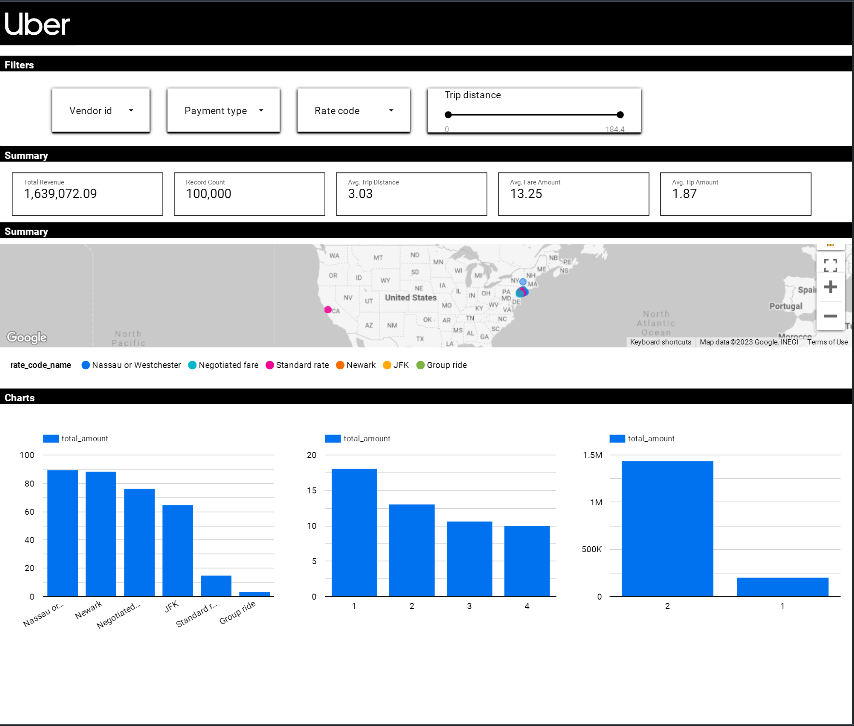

# Uber elt pipeline project

## Introduction

The objective of this project is to utilize a range of tools and technologies, such as GCP Storage, Python, Compute Instance, Mage Data Pipeline Tool, BigQuery, and Looker Studio, for the purpose of conducting data analytics on Uber data.

## Architecture 

## Technology Used
- Programming Language - Python

Google Cloud Platform
1. Google Storage
2. Compute Instance 
3. BigQuery
4. Looker Studio

Modern Data Pipeine Tool - https://www.mage.ai/

Contibute to this open source project - https://github.com/mage-ai/mage-ai

## Dataset Used
TLC Trip Record Data
Yellow and green taxi trip records include fields capturing pick-up and drop-off dates/times, pick-up and drop-off locations, trip distances, itemized fares, rate types, payment types, and driver-reported passenger counts. 

Here is the dataset used in the video - https://github.com/hauct/uber_etl_pipelines/main/data/uber_data.csv

More info about dataset can be found here:
1. Website - https://www.nyc.gov/site/tlc/about/tlc-trip-record-data.page
2. Data Dictionary - https://www.nyc.gov/assets/tlc/downloads/pdf/data_dictionary_trip_records_yellow.pdf

## Data Model

## Let's begin
### Import data 
Firstly, we need import the data in folder `data` into Google Cloud database. Following the instruction in the folder `.\setup\google_cloud_db\bucket_db` to do this
Make sure opening the access key to get the connection to the data

After that, you will need to create a virtual machines to operate the database. Following the instruction in the `.\setup\google_cloud_db\vm_instances` folder to do this. You may need the file `commands.txt` to copy and paster some code lines to import some necessary library

After finishing the setup in the `.\setup\google_cloud_db` folder, you can have the access on the link mage.ai:
`34.126.188.253:6789/pipeplines`
Note: This link can change depending on your google cloud account

## Create the pipelines on Mage.ai
Mage.ai is a tools that help you to automate the process etl task in data engineering

Keep following the instruction in the `.\setup\google_cloud_db\mage_ai` folder, there is three code file in the `.\mage-files` folder
to help you build the processing data pipeline

## Create the aggrigate table on Big Query
After you run the pipelines on mage.ai, please check on your project database to see the uploaded tables. We will write a SQL query to aggrigate one table, called `fact_table` in order to build our dashboard

Following the instruction in the `.\setup\big_query` folder for more detailed. The SQL query is in the `analytics_query.sql` file

## Build the dashboard on Looker Studio
Follow the instructions in the `.\setup\looker_studio` folder to connect to previously saved data.

The purpose of this task is to build a dashboard, to show the updated status of Revenue, Distance traveled, Amount of tips, location of car...

You can customize the dashboard according to your own needs

That is all of the project. Thanks for watching :D

